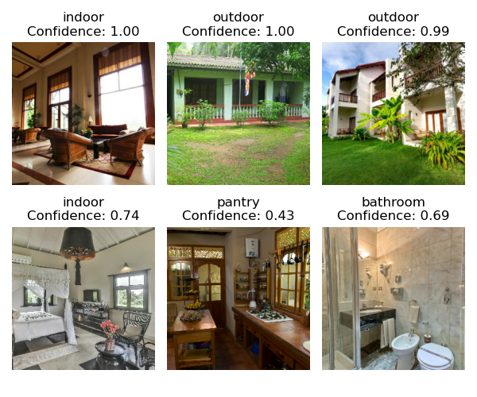
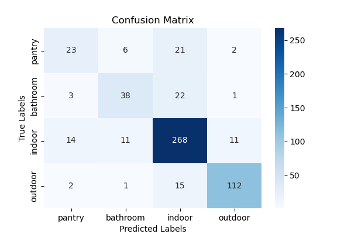

# House Image Classification for Sri Lankan Homes 🏠🖼️

## Project Overview 🌍
This project classifies Sri Lankan house images into four categories:
- **Pantry**
- **Bathroom**
- **Indoor**
- **Outdoor**

The objective of this model is to integrate with classified advertisement platforms to enhance their performance. It achieves an accuracy of **80%**.

---

## Key Features ✨
- Classifies images of Sri Lankan homes into four distinct categories.
- Achieves a validation accuracy of **80%**.
- Designed to support house classified advertisement platforms for better image classification.

---

## Tech Stack 🛠️
- **TensorFlow / Keras**
- **NumPy**
- **Matplotlib**
- **Pandas**
- **Python**

---

## File Organization 📂
- **Data/Labeled**: Contains training images (only dummy images are included; original dataset is not included due to ethical reasons).
- **Data/To_predict**: Images to be predicted.
- **training.ipynb**: Script to train the CNN model.
- **model.py**: Script to make predictions on new images.

---

## Usage Instructions ⚙️

Place images in the Data/To_predict folder and run model.ipynb notebook. 

## Data Sources 📥 ##
The data for this project is sourced from publicly available images. The training images are stored in the Data/Labeled folder. Only dummy images are included in this repository. The original dataset is excluded due to ethical considerations.

## Sample Predictions ##
The image below shows an example of how the model predicts the class of an image along with the confidence score.

The confusion matrix below shows how well the model classifies each category.

